# 07 · Flows and state machines

Step-by-step pictures of the main journeys, then the lifecycle of every entity that has a status.

## Part A · Flows

### A1. Sign in with a campus email code

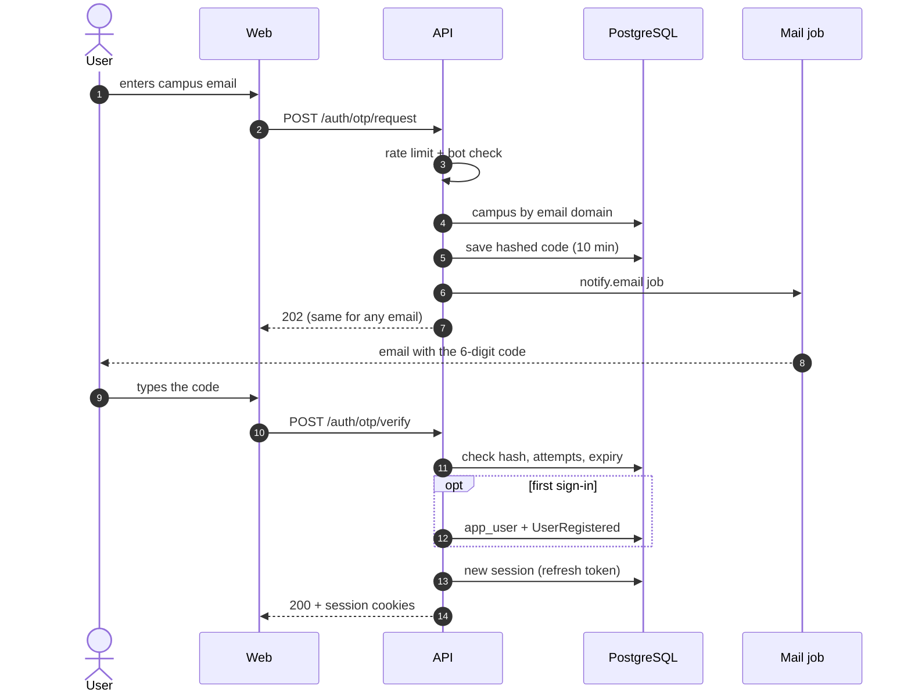
```mermaid
sequenceDiagram
  autonumber
  actor U as User
  participant W as Web
  participant A as API
  participant DB as PostgreSQL
  participant M as Mail job
  U->>W: enters campus email
  W->>A: POST /auth/otp/request
  A->>A: rate limit + bot check
  A->>DB: campus by email domain
  A->>DB: save hashed code (10 min)
  A->>M: notify.email job
  A-->>W: 202 (same for any email)
  M-->>U: email with the 6-digit code
  U->>W: types the code
  W->>A: POST /auth/otp/verify
  A->>DB: check hash, attempts, expiry
  opt first sign-in
    A->>DB: app_user + UserRegistered
  end
  A->>DB: new session (refresh token)
  A-->>W: 200 + session cookies
```

The OTP email is a job published straight from the handler: it is a command to one worker, not
a domain fact, so the outbox rule (which is about Kafka) does not apply. If the publish fails,
the handler returns 503 and the user asks again.

### A2. Catalog import (campus admin)

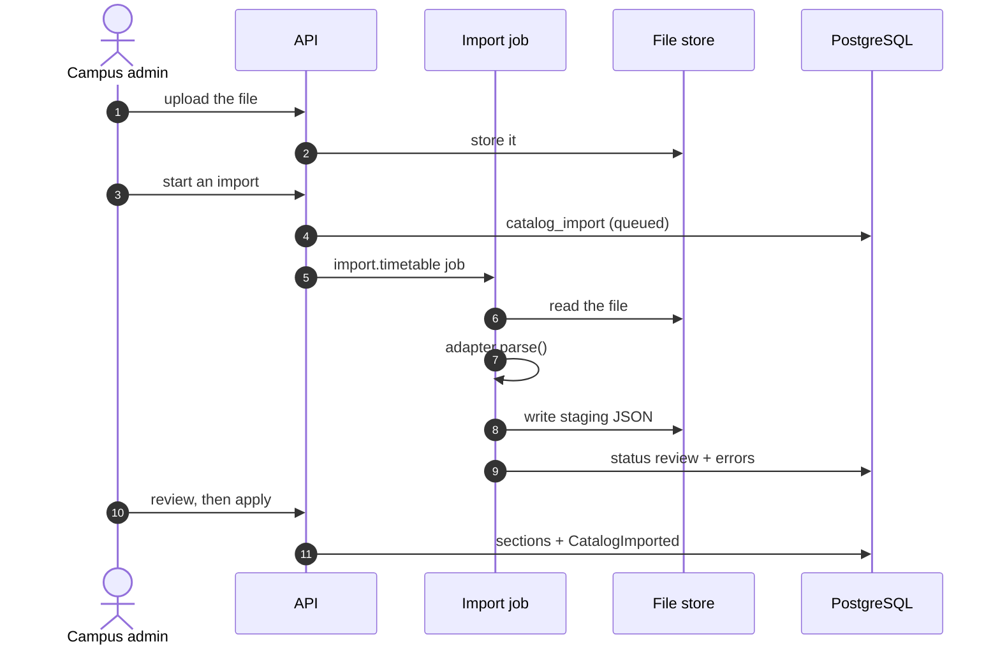
```mermaid
sequenceDiagram
  autonumber
  actor AD as Campus admin
  participant A as API
  participant J as Import job
  participant FS as File store
  participant DB as PostgreSQL
  AD->>A: upload the file
  A->>FS: store it
  AD->>A: start an import
  A->>DB: catalog_import (queued)
  A->>J: import.timetable job
  J->>FS: read the file
  J->>J: adapter.parse()
  J->>FS: write staging JSON
  J->>DB: status review + errors
  AD->>A: review, then apply
  A->>DB: sections + CatalogImported
```

### A3. Routine import from the grade report (privacy-critical)

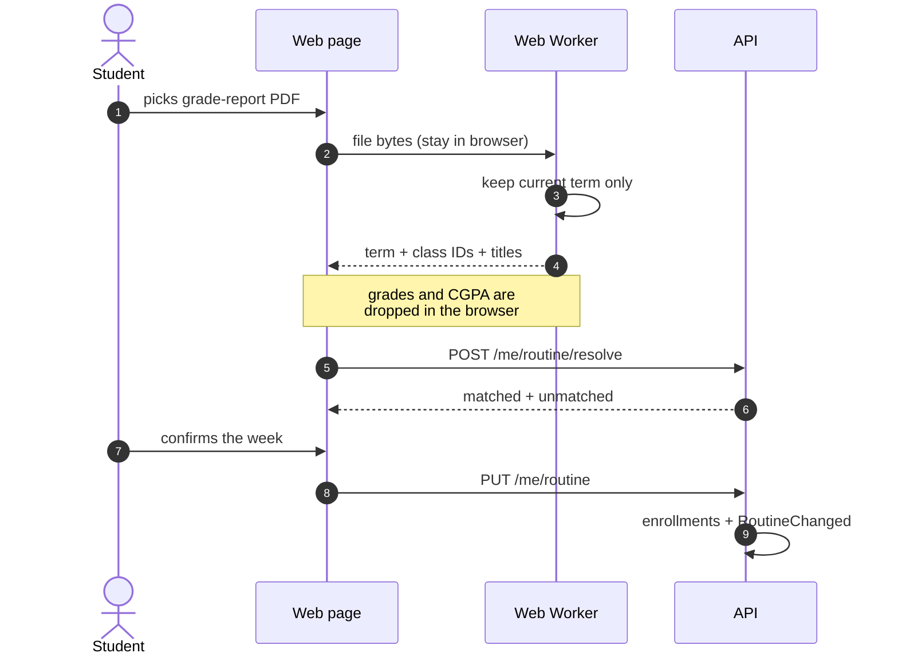
```mermaid
sequenceDiagram
  autonumber
  actor S as Student
  participant W as Web page
  participant PW as Web Worker
  participant A as API
  S->>W: picks grade-report PDF
  W->>PW: file bytes (stay in browser)
  PW->>PW: keep current term only
  PW-->>W: term + class IDs + titles
  Note over W,PW: grades and CGPA are<br/>dropped in the browser
  W->>A: POST /me/routine/resolve
  A-->>W: matched + unmatched
  S->>W: confirms the week
  W->>A: PUT /me/routine
  A->>A: enrollments + RoutineChanged
```

A test in `apps/web` asserts the request body of `/me/routine/resolve` contains only the allowed
keys, and an e2e test inspects network traffic for the PDF bytes.

### A4. Go now → matched → crew (the core loop)

**Part 1: from request to crew**

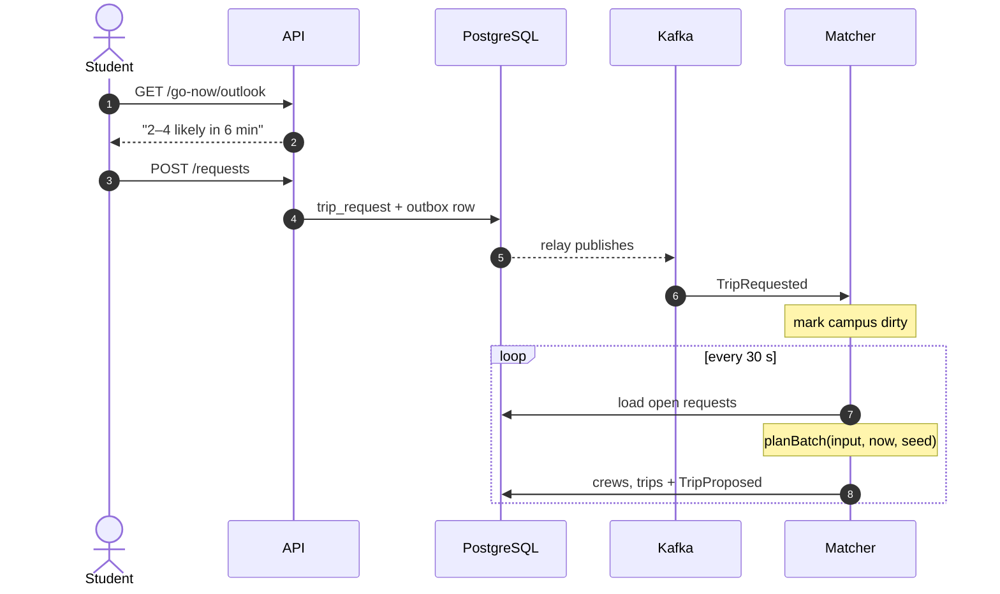
```mermaid
sequenceDiagram
  autonumber
  actor S as Student
  participant A as API
  participant DB as PostgreSQL
  participant K as Kafka
  participant M as Matcher
  S->>A: GET /go-now/outlook
  A-->>S: "2–4 likely in 6 min"
  S->>A: POST /requests
  A->>DB: trip_request + outbox row
  DB-->>K: relay publishes
  K->>M: TripRequested
  Note over M: mark campus dirty
  loop every 30 s
    M->>DB: load open requests
    Note over M: planBatch(input, now, seed)
    M->>DB: crews, trips + TripProposed
  end
```

**Part 2: from crew to confirmed**

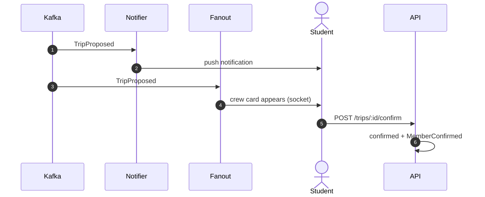
```mermaid
sequenceDiagram
  autonumber
  participant K as Kafka
  participant N as Notifier
  participant F as Fanout
  actor S as Student
  participant A as API
  K->>N: TripProposed
  N->>S: push notification
  K->>F: TripProposed
  F->>S: crew card appears (socket)
  S->>A: POST /trips/:id/confirm
  A->>A: confirmed + MemberConfirmed
```

If no group forms before the window ends, the matcher marks the request `expired` and the app
offers to go alone (with the booking links) or to wait longer.

### A5. Trip day: confirm → board → ride → arrive

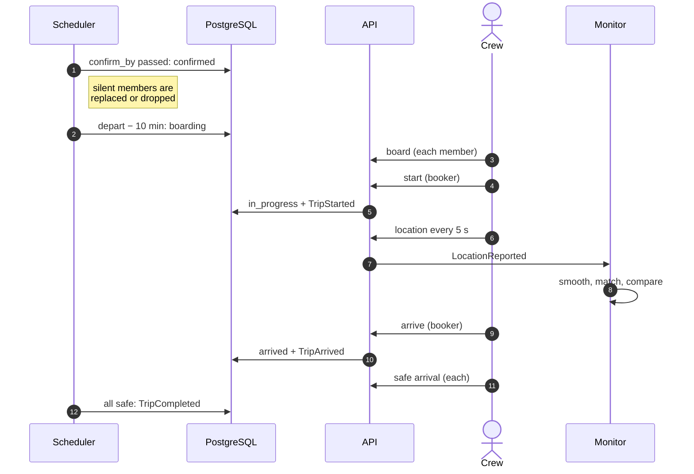
```mermaid
sequenceDiagram
  autonumber
  participant SC as Scheduler
  participant DB as PostgreSQL
  participant A as API
  actor C as Crew
  participant LM as Monitor
  SC->>DB: confirm_by passed: confirmed
  Note right of SC: silent members are<br/>replaced or dropped
  SC->>DB: depart − 10 min: boarding
  C->>A: board (each member)
  C->>A: start (booker)
  A->>DB: in_progress + TripStarted
  C->>A: location every 5 s
  A->>LM: LocationReported
  LM->>LM: smooth, match, compare
  C->>A: arrive (booker)
  A->>DB: arrived + TripArrived
  C->>A: safe arrival (each)
  SC->>DB: all safe: TripCompleted
```

### A6. Fare → fair split → ledger → weekly settlement

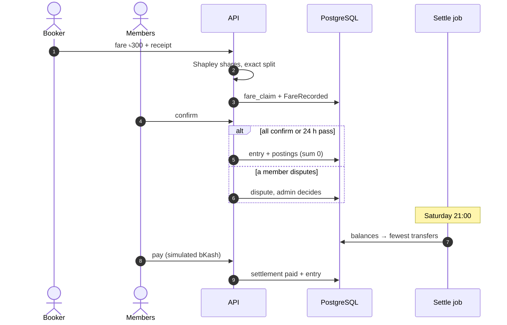
```mermaid
sequenceDiagram
  autonumber
  actor B as Booker
  actor M as Members
  participant A as API
  participant DB as PostgreSQL
  participant J as Settle job
  B->>A: fare ৳300 + receipt
  A->>A: Shapley shares, exact split
  A->>DB: fare_claim + FareRecorded
  M->>A: confirm
  alt all confirm or 24 h pass
    A->>DB: entry + postings (sum 0)
  else a member disputes
    A->>DB: dispute, admin decides
  end
  Note over J: Saturday 21:00
  J->>DB: balances → fewest transfers
  M->>A: pay (simulated bKash)
  A->>DB: settlement paid + entry
```

### A7. Class change → re-plan within 10 s

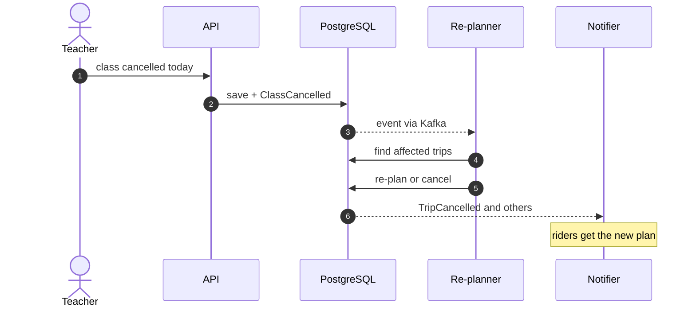
```mermaid
sequenceDiagram
  autonumber
  actor T as Teacher
  participant A as API
  participant DB as PostgreSQL
  participant RP as Re-planner
  participant N as Notifier
  T->>A: class cancelled today
  A->>DB: save + ClassCancelled
  DB-->>RP: event via Kafka
  RP->>DB: find affected trips
  RP->>DB: re-plan or cancel
  DB-->>N: TripCancelled and others
  Note over N: riders get the new plan
```

The 10-second target is measured in an integration test from the API call to the last outbox row.

### A8. SOS and safety checks

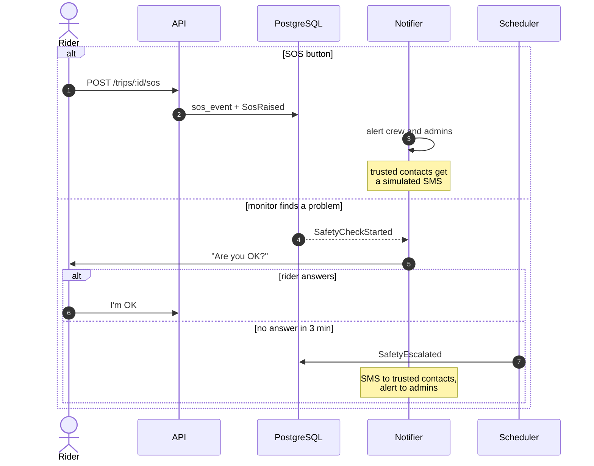
```mermaid
sequenceDiagram
  autonumber
  actor S as Rider
  participant A as API
  participant DB as PostgreSQL
  participant N as Notifier
  participant SC as Scheduler
  alt SOS button
    S->>A: POST /trips/:id/sos
    A->>DB: sos_event + SosRaised
    N->>N: alert crew and admins
    Note over N: trusted contacts get<br/>a simulated SMS
  else monitor finds a problem
    DB-->>N: SafetyCheckStarted
    N->>S: "Are you OK?"
    alt rider answers
      S->>A: I'm OK
    else no answer in 3 min
      SC->>DB: SafetyEscalated
      Note over N: SMS to trusted contacts,<br/>alert to admins
    end
  end
```

### A9. Notification with budget and fallback

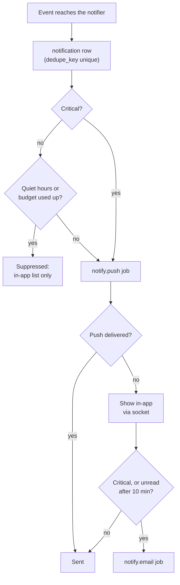
```mermaid
flowchart TB
  E["Event reaches the notifier"] --> R["notification row<br/>(dedupe_key unique)"]
  R --> P{"Critical?"}
  P -->|no| Q{"Quiet hours or<br/>budget used up?"}
  Q -->|yes| S["Suppressed:<br/>in-app list only"]
  Q -->|no| PUSH["notify.push job"]
  P -->|yes| PUSH
  PUSH --> OK{"Push delivered?"}
  OK -->|yes| DONE["Sent"]
  OK -->|no| IA["Show in-app<br/>via socket"]
  IA --> EM{"Critical, or unread<br/>after 10 min?"}
  EM -->|yes| MAIL["notify.email job"]
  EM -->|no| DONE
```

### A10. Onboarding agent (new university format)

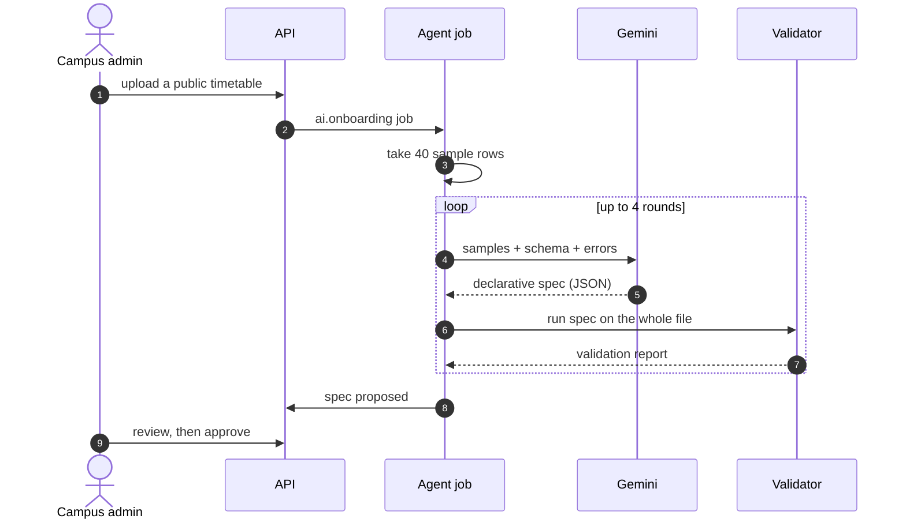
```mermaid
sequenceDiagram
  autonumber
  actor AD as Campus admin
  participant A as API
  participant J as Agent job
  participant G as Gemini
  participant V as Validator
  AD->>A: upload a public timetable
  A->>J: ai.onboarding job
  J->>J: take 40 sample rows
  loop up to 4 rounds
    J->>G: samples + schema + errors
    G-->>J: declarative spec (JSON)
    J->>V: run spec on the whole file
    V-->>J: validation report
  end
  J->>A: spec proposed
  AD->>A: review, then approve
```

The model never runs code: it only writes JSON that our validator interprets.

### A11. Shadow matching replay

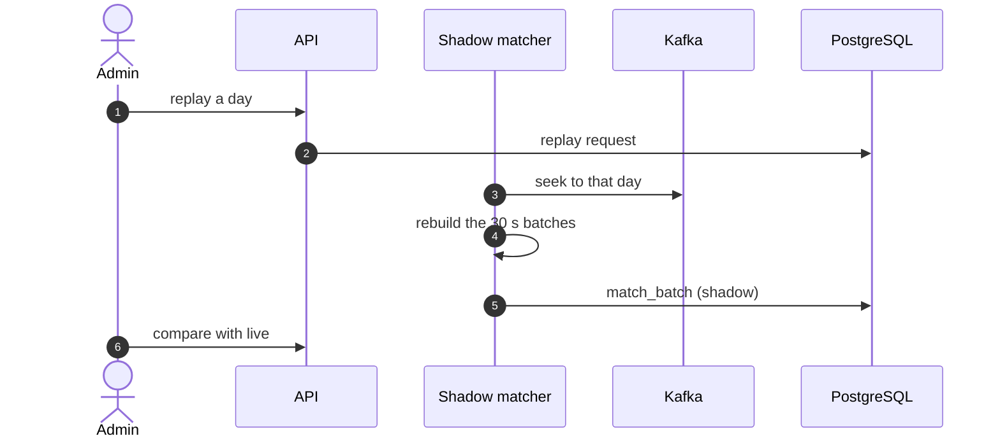
```mermaid
sequenceDiagram
  autonumber
  actor AD as Admin
  participant A as API
  participant SH as Shadow matcher
  participant K as Kafka
  participant DB as PostgreSQL
  AD->>A: replay a day
  A->>DB: replay request
  SH->>K: seek to that day
  SH->>SH: rebuild the 30 s batches
  SH->>DB: match_batch (shadow)
  AD->>A: compare with live
```

Replaying the same day with the same algorithm and seed must give identical groups (O4).

---

## Part B · State machines

Rule for all of them: a transition is an `UPDATE … WHERE id = $1 AND status = $from` (and
`version = $v` for trips). Zero rows updated → `409 STATE_CONFLICT`. Each transition that others
care about writes its outbox event in the same transaction.

### B1. `trip`

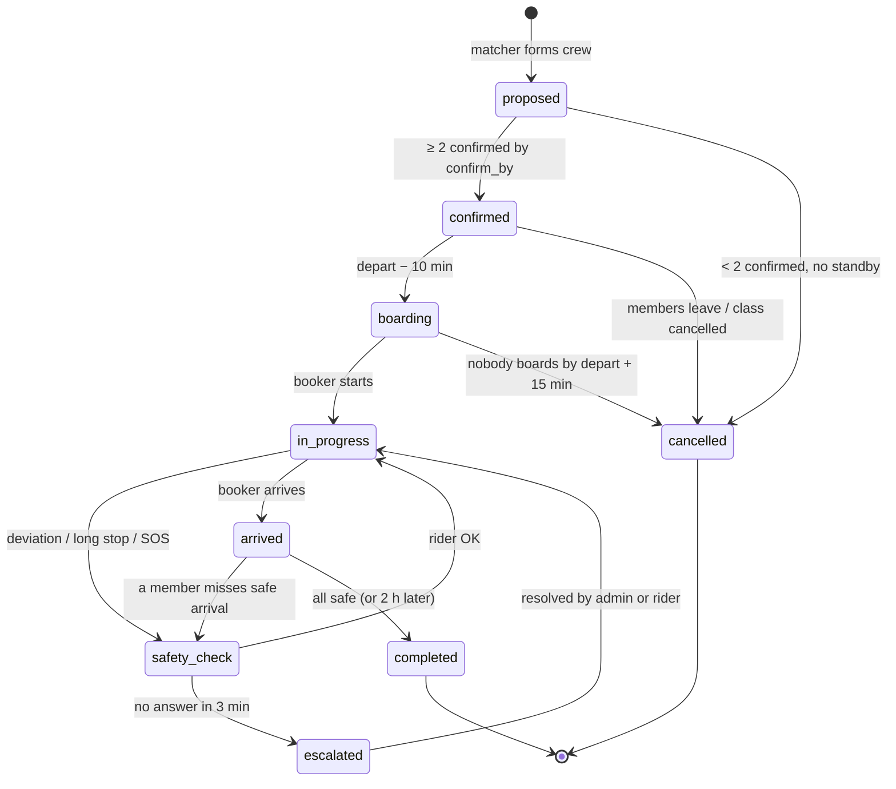
```mermaid
stateDiagram-v2
  [*] --> proposed: matcher forms crew
  proposed --> confirmed: ≥ 2 confirmed by confirm_by
  proposed --> cancelled: < 2 confirmed, no standby
  confirmed --> boarding: depart − 10 min
  confirmed --> cancelled: members leave / class cancelled
  boarding --> in_progress: booker starts
  boarding --> cancelled: nobody boards by depart + 15 min
  in_progress --> safety_check: deviation / long stop / SOS
  safety_check --> in_progress: rider OK
  safety_check --> escalated: no answer in 3 min
  escalated --> in_progress: resolved by admin or rider
  in_progress --> arrived: booker arrives
  arrived --> safety_check: a member misses safe arrival
  arrived --> completed: all safe (or 2 h later)
  completed --> [*]
  cancelled --> [*]
```

`next_action_at` per state: proposed → `confirm_by`; confirmed → depart − 10 min; boarding →
depart + 15 min; safety_check → `escalate_at`; arrived → arrival + ETA + 15 min.

### B2. `trip_request`

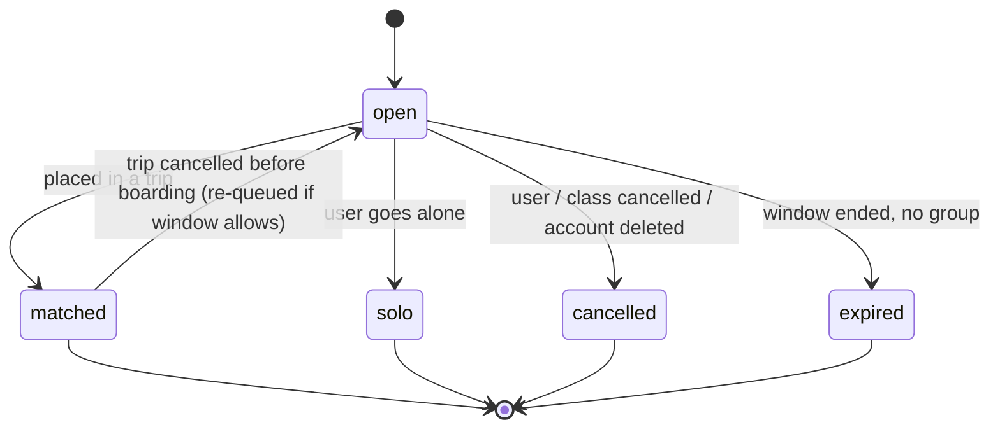
```mermaid
stateDiagram-v2
  [*] --> open
  open --> matched: placed in a trip
  open --> solo: user goes alone
  open --> cancelled: user / class cancelled / account deleted
  open --> expired: window ended, no group
  matched --> open: trip cancelled before boarding (re-queued if window allows)
  matched --> [*]
  solo --> [*]
  cancelled --> [*]
  expired --> [*]
```

### B3. `trip_participant`

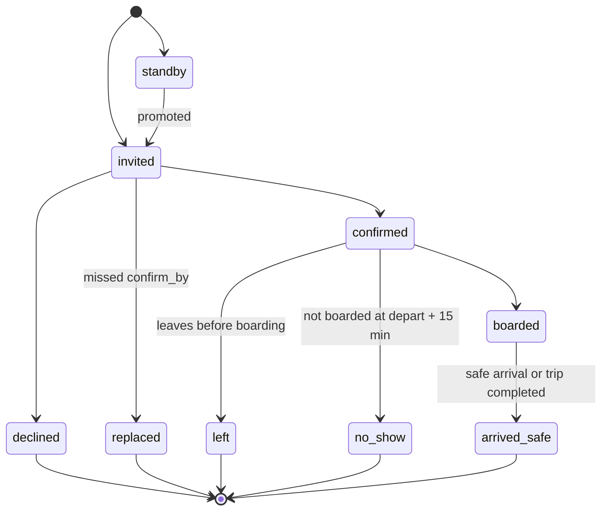
```mermaid
stateDiagram-v2
  [*] --> invited
  [*] --> standby
  standby --> invited: promoted
  invited --> confirmed
  invited --> declined
  invited --> replaced: missed confirm_by
  confirmed --> left: leaves before boarding
  confirmed --> boarded
  confirmed --> no_show: not boarded at depart + 15 min
  boarded --> arrived_safe: safe arrival or trip completed
  declined --> [*]
  replaced --> [*]
  left --> [*]
  no_show --> [*]
  arrived_safe --> [*]
```

### B4. `fare_claim`

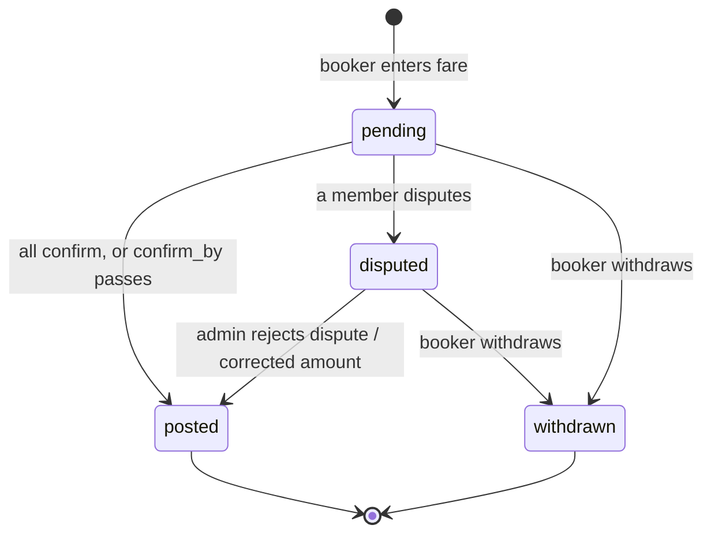
```mermaid
stateDiagram-v2
  [*] --> pending: booker enters fare
  pending --> posted: all confirm, or confirm_by passes
  pending --> disputed: a member disputes
  disputed --> posted: admin rejects dispute / corrected amount
  disputed --> withdrawn: booker withdraws
  pending --> withdrawn: booker withdraws
  posted --> [*]
  withdrawn --> [*]
```

### B5. `settlement`

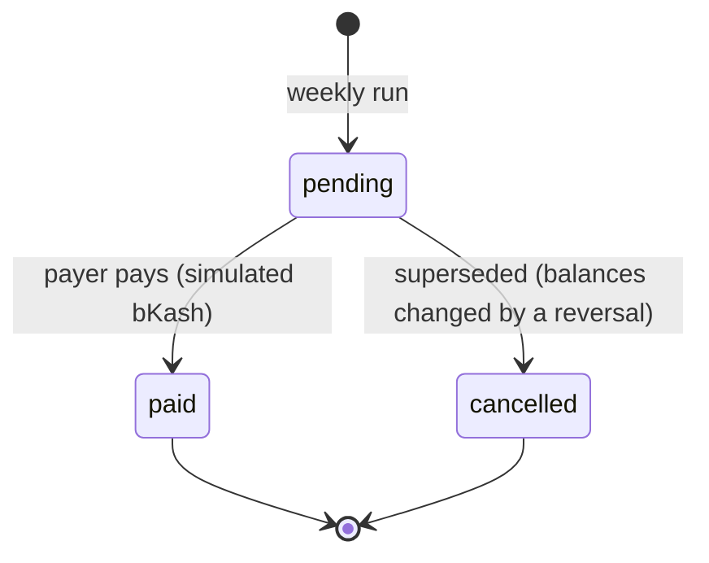
```mermaid
stateDiagram-v2
  [*] --> pending: weekly run
  pending --> paid: payer pays (simulated bKash)
  pending --> cancelled: superseded (balances changed by a reversal)
  paid --> [*]
  cancelled --> [*]
```

### B6. `catalog_import` and `onboarding_spec`

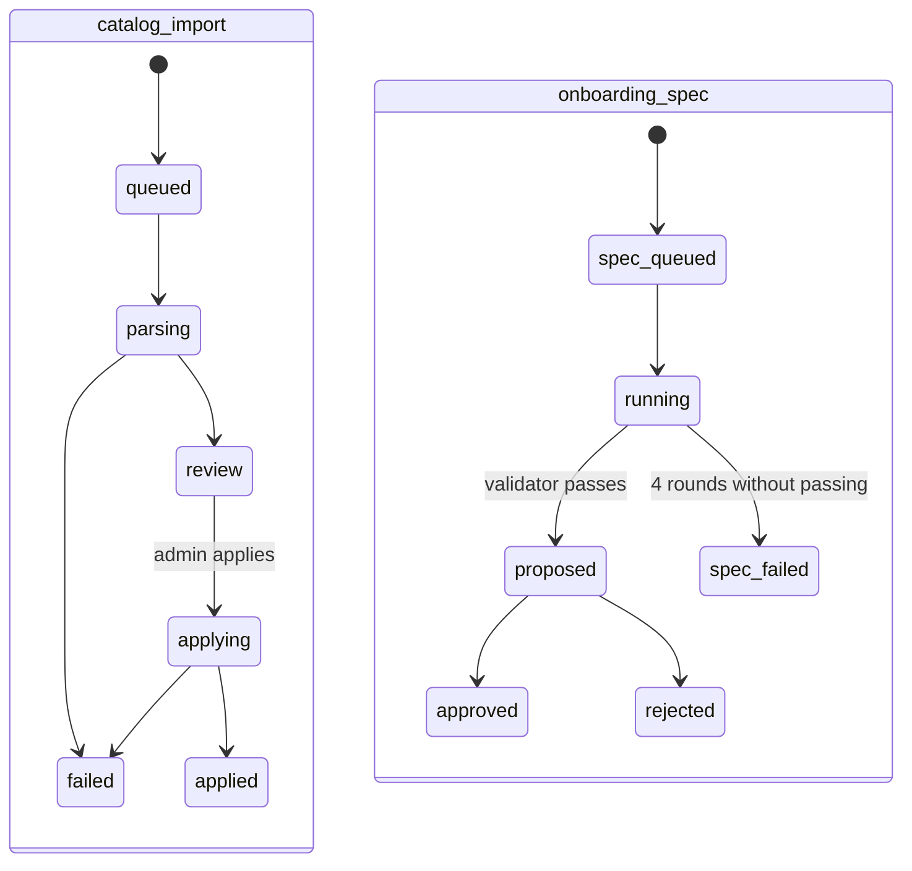
```mermaid
stateDiagram-v2
  state catalog_import {
    [*] --> queued
    queued --> parsing
    parsing --> review
    parsing --> failed
    review --> applying: admin applies
    applying --> applied
    applying --> failed
  }
  state onboarding_spec {
    [*] --> spec_queued
    spec_queued --> running
    running --> proposed: validator passes
    running --> spec_failed: 4 rounds without passing
    proposed --> approved
    proposed --> rejected
  }
```

### B7. `seat_booking`

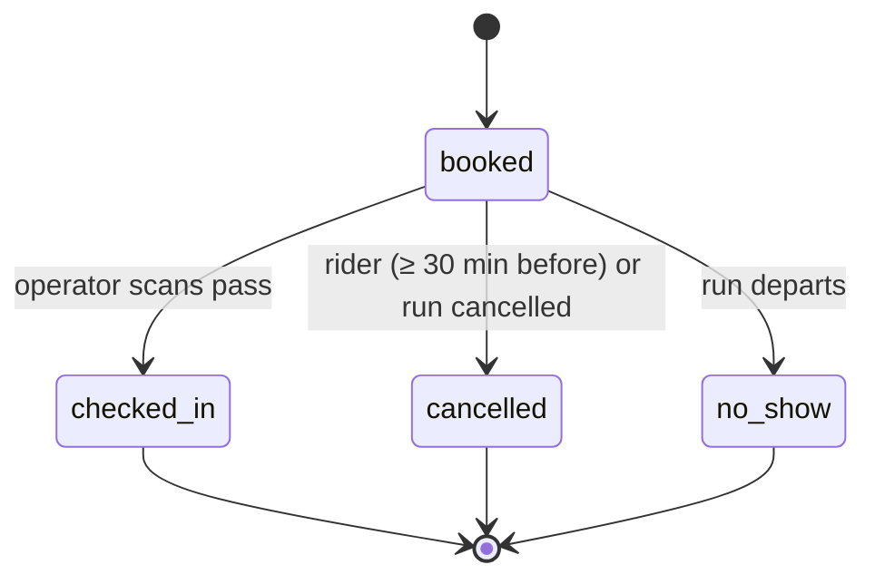
```mermaid
stateDiagram-v2
  [*] --> booked
  booked --> cancelled: rider (≥ 30 min before) or run cancelled
  booked --> checked_in: operator scans pass
  booked --> no_show: run departs
  checked_in --> [*]
  cancelled --> [*]
  no_show --> [*]
```

### B8. `safety_check`, `class_change_report`, `report`

`safety_check`:

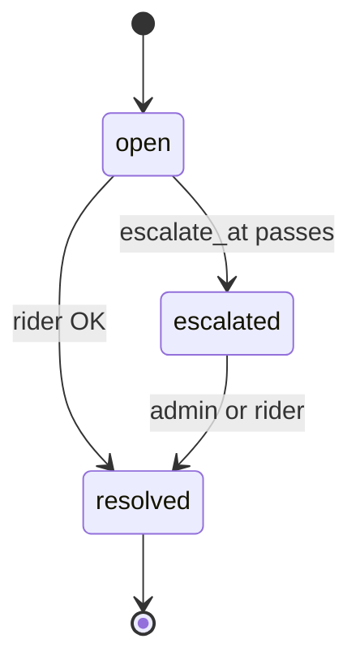
```mermaid
stateDiagram-v2
  [*] --> open
  open --> resolved: rider OK
  open --> escalated: escalate_at passes
  escalated --> resolved: admin or rider
  resolved --> [*]
```

`class_change_report`:

```mermaid
stateDiagram-v2
  [*] --> pending
  pending --> applied: teacher, 2nd student or admin
  pending --> rejected: admin
  pending --> expired: date passed
  applied --> [*]
  rejected --> [*]
  expired --> [*]
```

`report`:

```mermaid
stateDiagram-v2
  [*] --> open
  open --> reviewing
  reviewing --> actioned
  reviewing --> dismissed
  actioned --> [*]
  dismissed --> [*]
```
